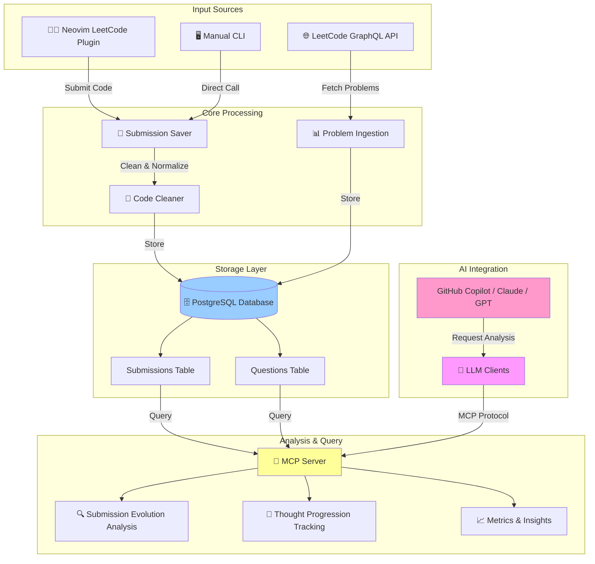
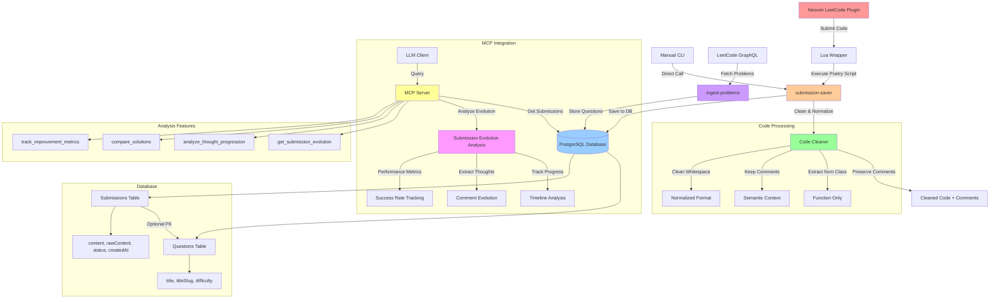

# LeetCode QA with Submission Evolution Tracking

A LeetCode Q&A system using LlamaIndex with submission tracking and MCP integration for analyzing problem-solving evolution.

## Overview



**Current Status**: ✅ Per-Question Submission Tracking | ✅ MCP Integration | 🚧 Cross-Question Analytics

## Docker Compose (submission_server + mcp-server)

You can run the two backend services with Docker Compose:

- `submission_server` on TCP `3000`
- `mcp_server` in MCP `stdio` mode

### Prerequisites

- Docker + Docker Compose installed
- `.env` exists at project root and contains `DEV_DB_URL` and `PROD_DB_URL`

### Start

```bash
make compose-build ENV=dev
make compose-up ENV=dev
```

For production DB URL:

```bash
make compose-up ENV=prod
```

### Stop

```bash
make compose-down ENV=dev
```

### Notes

- Compose uses `DATABASE_URL`, passed by `Makefile` from `ENV`:
  - `ENV=dev` → `DEV_DB_URL`
  - `ENV=prod` → `PROD_DB_URL`
- `submission_server` is configured with `SUBMISSION_HOST=0.0.0.0` so port publishing works.
- `mcp_server` uses `mcp-server-stdio`; it does not expose an HTTP port in this setup.

## System Architecture



## MCP Features for Submission Evolution

### 1. Submission Timeline Analysis
- **Track all attempts** for a specific problem over time
- **Identify improvement patterns** in code quality and approach
- **Analyze success/failure progression** 

### 2. Thought Evolution Tracking
- **Extract comments** from each submission to understand thought process
- **Compare reasoning** between early and later attempts
- **Identify learning patterns** and conceptual breakthroughs

### 3. Code Quality Metrics
- **Complexity reduction** over time
- **Performance improvements** (time/space complexity)
- **Code readability** and style evolution

### 4. LLM Integration Capabilities
When connected to an LLM via MCP, the system can answer:

- *"How did my approach to two-sum problem evolve over time?"*
- *"What were my initial thoughts vs. final solution for binary search problems?"*
- *"Show me the progression of my understanding of dynamic programming"*
- *"Which problems took me the most attempts to solve correctly?"*
- *"How did my commenting style and problem analysis improve?"*

## Flow Description

1. **Code Submission**: Neovim plugin captures code with inline comments
2. **Processing**: Code cleaned while preserving comments for semantic analysis
3. **Storage**: Timestamped submissions with both cleaned and raw versions
4. **MCP Analysis**: LLM queries submission history for evolution insights
5. **Thought Tracking**: Comments analyzed for learning progression

---

## `submission_server` Package Structure

The `packages/submission_server` package is the core backend responsible for receiving, storing, and serving submission data.

```
packages/submission_server/
├── pyproject.toml              # Package config & script entry points
├── Makefile                    # Dev targets (dev, dev-api, install, clean)
├── ARCHITECTURE.md             # Server design overview (TCP vs HTTP)
├── README.md                   # Package-level docs
├── docs/
│   └── agenda.md               # Development agenda & notes
├── tests/
│   ├── test_code_cleaner.py    # Unit tests for code cleaning logic
│   └── test_submission_db_saver.lua  # Integration test for Lua TCP client
└── src/
    ├── submission_server.py    # TCP server (port 3000) — nvim integration
    │                           #   Actions: save_submission, start_timer (via start_session),
    │                           #            stop_timer, get_active_timers
    ├── analytics_server.py     # HTTP/REST API (port 8000) — read-only analytics
    │                           #   GET /api/graph, /api/problems/{slug},
    │                           #        /api/tags, /api/stats
    ├── code_cleaner.py         # Strips boilerplate, preserves inline comments
    ├── submission_db_saver.lua # Lua client for nvim → TCP server communication
    ├── graph_models.py         # Pydantic models for problem graph API
    ├── graph_service.py        # Graph construction (tag similarity + explicit edges)
    ├── problem_graph.py        # CLI entry point: generate/export problem graph
    ├── submission_stats.py     # CLI entry point: print submission statistics
    └── timer_service.py        # In-memory timer state management
```

### Design Decisions

| Component | Protocol | Port | Purpose |
|---|---|---|---|
| `submission_server.py` | TCP + JSON-newline | 3000 | Low-latency write path from nvim via `nc` |
| `analytics_server.py` | HTTP/REST (FastAPI) | 8000 | Read-only analytics; CORS-enabled for frontend |
| `submission_db_saver.lua` | TCP client | — | Lua wrapper used by the Neovim plugin |
| `code_cleaner.py` | — | — | Normalises code before DB storage while keeping comments |
| `timer_service.py` | — | — | Tracks per-problem solve-time sessions in memory |

### Why is there a Timer?

The timer answers a key analytics question: **how long did it actually take to solve a problem?**

Submission count and code evolution tell you *what* changed, but time-spent tells you *how hard* the problem was at each attempt. This unlocks metrics like:

- Which problems caused the longest struggle before acceptance
- Whether solve time decreases on revisit (a concrete measure of learning)
- Correlating time-per-attempt with the type of mistake made

#### Timer Lifecycle

```
Open problem in Neovim
        │
        ▼
  start_timer (title_slug)          ← sent by Lua plugin via `Leet session start`
  [in-memory: timers[slug] = now()]
        │
        │  (coding happens)
        │
        ▼
  save_submission (title_slug, code, item)
        │
        ├─ timer active? → attach elapsed minutes to submission row (timeSpentMinutes)
        │
        ├─ status == "Accepted"?
        │       ├── stop timer  → persist ProblemSession to DB
        │       └── restart timer  (tracks time for any follow-up attempt)
        │
        └─ status != "Accepted"?  → timer keeps running (accumulates across failed attempts)
```

#### Key Behaviours

| Situation | Behaviour |
|---|---|
| Opening a new problem | `Leet session start` clears any other active timer and starts fresh (only one active problem at a time by default) |
| Failed submission | Timer keeps running; elapsed time is still snapshotted onto the submission row |
| Accepted submission | Timer is stopped → session saved to `ProblemSession` table → timer restarted for follow-up work |
| Code contains `#TEST#` | Submission is **skipped entirely** — not saved, timer unaffected |
| Code contains `#CHEAT#` | Submission saved with `isCheat = true` flag for later revisit |
| Server restart | In-memory timers are lost; DB sessions already committed are retained |

#### Storage

- **`Submission.timeSpentMinutes`** — elapsed minutes at the moment a submission is saved (snapshot, not total)
- **`ProblemSession`** — a dedicated table recording completed sessions (stopped timers), enabling total-time-per-problem queries independent of submission count

---

## 🗺️ ROADMAP

### ✅ Phase 1: Foundation (Completed)
**Goal**: Basic submission tracking and per-question analysis

- [x] **Database Schema Design**
  - Questions table with LeetCode metadata
  - Submissions table with timestamps and status tracking
  - Prisma ORM integration
  
- [x] **Submission Capture Pipeline**
  - Neovim plugin integration via Lua wrapper
  - Code cleaner that preserves comments
  - Automatic timestamping and status tracking
  
- [x] **MCP Server Implementation**
  - `get_submission_evolution`: Timeline analysis for specific questions
  - `analyze_thought_progression`: Comment evolution tracking per question
  - FastMCP-based server with stdio transport for GitHub Copilot
  
- [x] **Per-Question Analytics**
  - Submission timeline visualization
  - Success rate progression
  - Code length trends
  - Comment density analysis
  - Complexity awareness tracking

### 🚧 Phase 2: Enhanced Analytics (In Progress)
**Goal**: Cross-question insights and pattern recognition

- [ ] **Cross-Question Pattern Analysis**
  - Identify recurring mistakes across different problems
  - Track algorithmic patterns (DP, Two Pointers, Sliding Window, etc.)
  - Analyze success rates by problem category
  - Compare solving strategies across similar problems
  
- [ ] **Learning Curve Metrics**
  - Problem difficulty progression tracking
  - Time-to-solve trends over time
  - Retry rate analysis by topic
  - Skill development heatmaps
  
- [ ] **Advanced MCP Tools**
  - `compare_problems`: Side-by-side submission evolution comparison
  - `get_topic_mastery`: Analyze proficiency by algorithmic topic
  - `identify_weak_areas`: Suggest problems based on struggle patterns
  - `get_learning_insights`: Overall coding journey analytics

### 🔮 Phase 3: Intelligent Recommendations (Planned)
**Goal**: AI-powered personalized learning assistance

- [ ] **Smart Problem Recommendations**
  - Analyze weak areas and recommend targeted problems
  - Progressive difficulty adjustment based on success patterns
  - Topic-based learning path generation
  
- [ ] **Code Review & Feedback**
  - Automatic code quality analysis
  - Best practice suggestions based on historical patterns
  - Anti-pattern detection from past mistakes
  
- [ ] **Comparative Analytics**
  - Compare your solutions with optimal approaches
  - Benchmark against submission statistics
  - Identify optimization opportunities
  
- [ ] **Study Session Planning**
  - Optimal review scheduling (spaced repetition)
  - Problem clustering by similarity
  - Weekly/monthly progress reports

### 🌟 Phase 4: Community & Advanced Features (Future)
**Goal**: Collaborative learning and advanced tooling

- [ ] **Multi-User Support**
  - Team/study group analytics
  - Peer comparison (anonymized)
  - Collaborative problem-solving sessions
  
- [ ] **Enhanced Visualization**
  - Interactive dashboards
  - Progress graphs and charts
  - Knowledge graph of problem relationships
  
- [ ] **Integration Expansions**
  - Support for other coding platforms (HackerRank, CodeForces)
  - IDE plugins (VS Code, IntelliJ)
  - Mobile app for progress tracking
  
- [ ] **Advanced AI Features**
  - Natural language problem explanation generation
  - Automated hint system without spoilers
  - Voice-based coding session reviews

### 📊 Current Limitations
The system currently supports:
- ✅ **Single question analysis**: Detailed evolution tracking for individual problems
- ✅ **MCP integration**: Query via LLM clients (Copilot, Claude, GPT)
- ✅ **Comment tracking**: Thought process evolution within single problems

What's **NOT** yet supported:
- ❌ **Cross-question analytics**: No pattern recognition across multiple problems
- ❌ **Topic-based insights**: Cannot aggregate by algorithmic categories
- ❌ **Recommendation engine**: No personalized problem suggestions
- ❌ **Comparative analysis**: Cannot compare different problems' evolution
- ❌ **Batch analytics**: No workspace-wide statistics or reports

### 🎯 Next Milestone: Cross-Question Analytics
**Target**: Enable pattern recognition across entire submission history

**Key Deliverables**:
1. Topic tagging system for problems
2. Cross-problem pattern detection algorithms
3. New MCP tools for aggregate analytics
4. Dashboard for visual progress tracking

**Expected Impact**: Transform from single-problem tracker to comprehensive learning analytics platform

---
