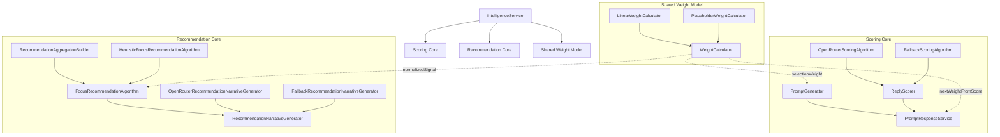

# Core Module

This folder contains the domain logic for the intelligence service. It is the layer that:

- selects a past LeetCode submission to revisit
- builds a prompt for the user
- scores the user's reply
- updates per-question learning weights
- recommends which questions to focus on next

## Files

- `index.ts`: orchestration entrypoint used by the service runtime
- `env.ts`: environment parsing and defaults
- `types.ts`: shared domain types
- `shared/weight.ts`: shared weight abstraction used by both cores
- `scoring/`: prompt generation, scoring, and reply evaluation
- `recommendation/`: focus recommendation ranking and narrative generation

## Core Layout

The domain is split into two cores that share one abstract weight model.

- `scoring core`
  - `scoring/prompt.ts`
  - `scoring/scoring.ts`
  - `scoring/response.ts`
- `recommendation core`
  - `recommendation/data.ts`
  - `recommendation/algorithm.ts`
  - `recommendation/narrative.ts`
  - `recommendation/index.ts`
- `shared weight model`
  - `shared/weight.ts`

Each core is intentionally extensible:

- `scoring/scoring.ts`
  - `ScoringAlgorithm`
  - `OpenRouterScoringAlgorithm`
  - `FallbackScoringAlgorithm`
  - `ReplyScorer`
- `recommendation/algorithm.ts`
  - `FocusRecommendationAlgorithm`
  - `HeuristicFocusRecommendationAlgorithm`
  - `PlaceholderFocusRecommendationAlgorithm`
- `recommendation/narrative.ts`
  - `RecommendationNarrativeGenerator`
  - `OpenRouterRecommendationNarrativeGenerator`
  - `FallbackRecommendationNarrativeGenerator`
  - `PlaceholderRecommendationNarrativeGenerator`
- `shared/weight.ts`
  - `WeightCalculator`
  - `LinearWeightCalculator`
  - `PlaceholderWeightCalculator`

The shared weight layer defines the common meaning of a question weight:

- default weight for unseen questions
- minimum selection weight for weighted sampling
- score-to-weight update delta
- bounded next weight computation
- normalized weight signal for recommendations

The default implementation is `LinearWeightCalculator`. Future policies can plug in through the same interface without changing prompt selection, response handling, or recommendation ranking code.

## Architecture Diagram



## End-to-End Flow

1. `IntelligenceService.triggerPrompt()` calls `PromptGenerator.generate()`.
2. `PromptGenerator` loads recent submissions, joins them with question metadata and existing weights, and performs weighted random selection through `WeightCalculator.selectionWeight()`.
3. A prompt event is persisted to `intelligencePromptEvent`.
4. The client layer sends the prompt to Discord or CLI.
5. A reply comes back through `scorePromptReply()` or `scorePromptReplyByMessageId()`.
6. `PromptResponseService` asks `ReplyScorer` for a structured score.
7. `PromptResponseService` computes the next weight through `WeightCalculator.nextWeightFromScore()`.
8. The reply, score, and updated weight are written in one transaction.
9. `FocusRecommendationService` uses the accumulated weights and history to rank what to practice next.
10. `RecommendationNarrativeGenerator` turns the ranked results into a short study narrative.

## Prompt Selection

Prompt selection happens in `scoring/prompt.ts`.

- The service reads recent submissions, capped by `INTELLIGENCE_MAX_CANDIDATES`.
- It keeps only the first `INTELLIGENCE_SELECTION_WINDOW` viable candidates.
- Each candidate gets a selection weight from `intelligenceWeight.weight`.
- If a question has no recorded weight yet, it falls back to `WeightCalculator.defaultWeight`.
- Final selection is weighted random through `WeightCalculator.selectionWeight()`, not pure top-1.

This means weaker questions are more likely to resurface, but the system still keeps some variety.

## Reply Scoring

Reply scoring happens in `scoring/scoring.ts` and is strategy-based.

Primary path:

- If `OPEN_ROUTER_API_KEY` is present, `OpenRouterScoringAlgorithm` sends the prompt context, prior submission, and raw reply to OpenRouter.
- The model is asked to return structured JSON with:
  - `score` in the range `1-5`
  - `approachSummary`
  - `complexityNotes`
  - `blindSpots`
  - `recommendedAnswer`
  - `tags`
  - `reason`

Fallback path:

- If OpenRouter is unavailable, `ReplyScorer` falls back to `FallbackScoringAlgorithm`.
- The fallback is intentionally simple:
  - reply length `>= 120` chars => score `4`
  - reply length `>= 40` chars => score `3`
  - otherwise => score `2`

The fallback exists for resiliency, not for nuanced evaluation.

## Weight Updates

Weight updates happen in `scoring/response.ts`.

After a reply is scored, the service computes the next weight through `WeightCalculator.nextWeightFromScore()`.

The default `LinearWeightCalculator` uses:

```ts
delta = (3 - score) * 0.25
nextWeight = clamp(previousWeight + delta, INTELLIGENCE_MIN_WEIGHT, INTELLIGENCE_MAX_WEIGHT)
```

Implications:

- score below `3` increases the weight
- score above `3` decreases the weight
- score `3` leaves the weight unchanged

In practice, lower-scoring questions become more likely to be selected again later.

This logic is now centralized in `shared/weight.ts`, so changing the weight policy updates both scoring-side weight mutation and recommendation-side weight interpretation together.

The response transaction writes:

- `intelligenceResponse`
- updates `intelligencePromptEvent`
- upserts `intelligenceWeight`
- inserts `intelligenceWeightAudit`

## Focus Recommendations

Recommendation ranking happens in `recommendation/index.ts`.

The recommendation core has three layers:

- `RecommendationAggregationBuilder`
  - converts raw submissions and prompt events into aggregate signals
- `FocusRecommendationAlgorithm`
  - ranks candidate questions
- `RecommendationNarrativeGenerator`
  - explains the ranked results in a short human-readable summary

The default `HeuristicFocusRecommendationAlgorithm` gives each question a `priority` based on a combination of signals:

- current learning `weight`
- recent submission failure rate
- staleness since last prompt or response
- difficulty boost
- low historical average reply score

The recommendation core does not define its own weight semantics. It reuses the shared weight model through `WeightCalculator.normalizedSignal()` before combining weight with the other signals.

The service then sorts by `priority`, returns the top K, and passes the result to a narrative generator.

Default narrative behavior:

- If `OPEN_ROUTER_API_KEY` is present, `OpenRouterRecommendationNarrativeGenerator` asks the model for a short study plan summary.
- If OpenRouter is unavailable or returns an empty result, the narrative falls back to a simple slug list.
- `PlaceholderRecommendationNarrativeGenerator` exists as an extension point for future template-based or history-aware explanations.

## Health and Database Access

The service layer uses `IntelligenceService.withDatabase()` to connect only around active operations.

Current behavior:

- prompt generation hits the database
- reply scoring hits the database
- recommendations hit the database
- `health()` does not query the database

This is intentional so health checks do not keep Neon awake unnecessarily.

## Important Config

Defined in `env.ts`:

- `MODEL`
- `OPEN_ROUTER_API_KEY`
- `INTELLIGENCE_PROMPT_CRON`
- `INTELLIGENCE_RECOMMEND_CRON`
- `INTELLIGENCE_RECOMMEND_TOP_K`
- `INTELLIGENCE_RECOMMEND_LOOKBACK_DAYS`
- `INTELLIGENCE_MAX_CANDIDATES`
- `INTELLIGENCE_SELECTION_WINDOW`
- `INTELLIGENCE_MIN_WEIGHT`
- `INTELLIGENCE_MAX_WEIGHT`

## Notes for Future Changes

- Keep prompt selection, reply scoring, and recommendation logic separate. They evolve at different speeds.
- If you change the weight policy, do it in `WeightCalculator` so prompt selection, response updates, and recommendation ranking stay consistent.
- If you add a new scoring backend, preserve the same `LlmScore` output shape.
- If you add a new recommendation algorithm or narrative generator, prefer implementing the existing interfaces instead of branching service orchestration code.
